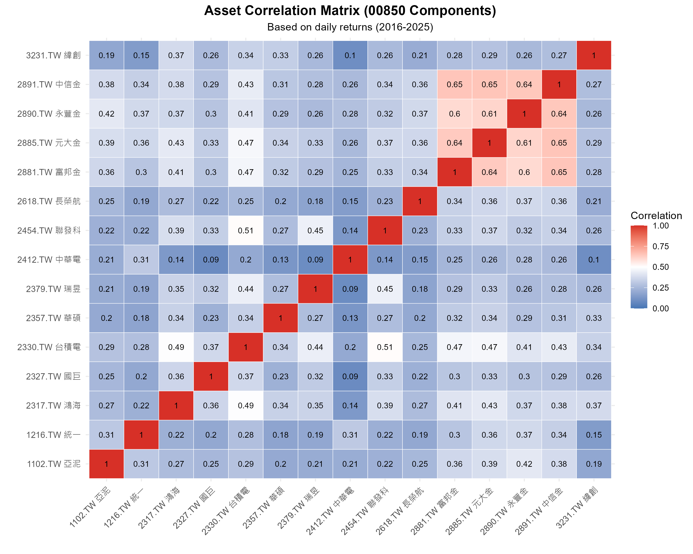
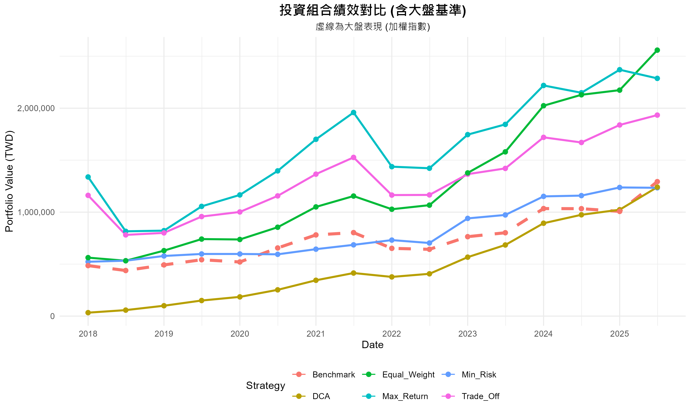
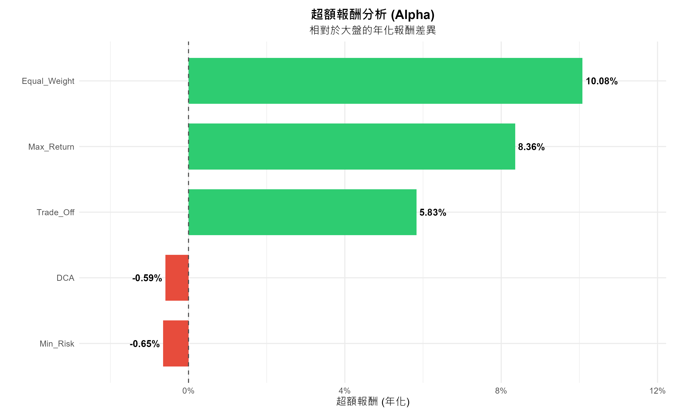
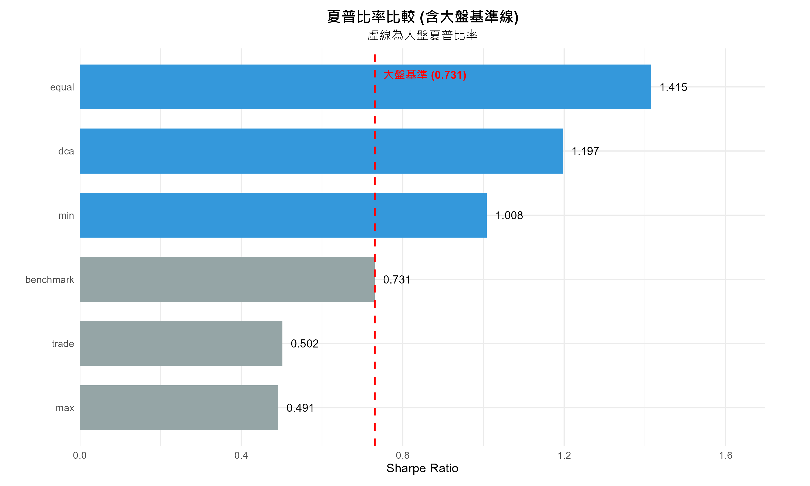
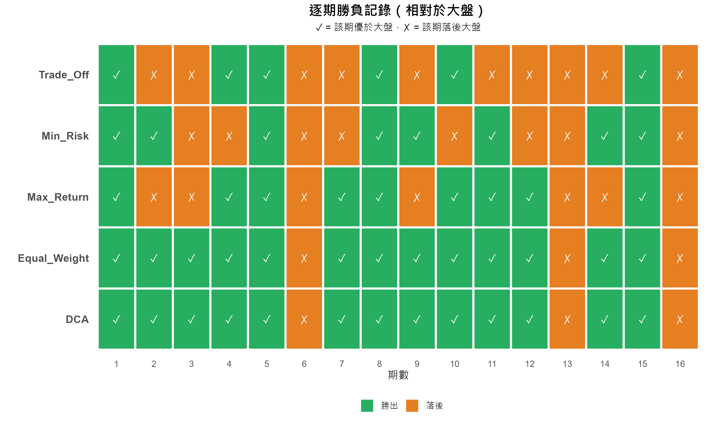
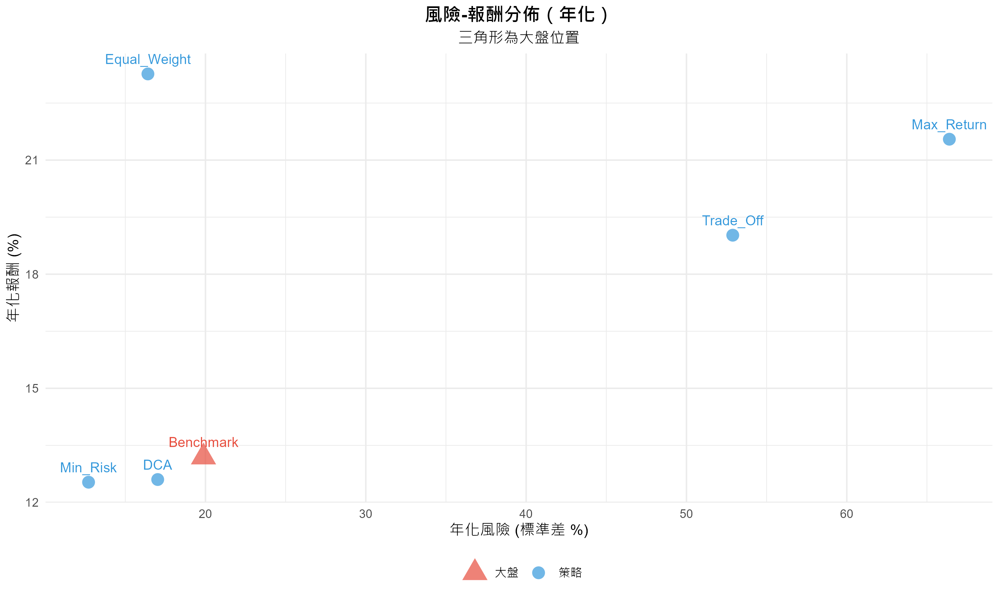
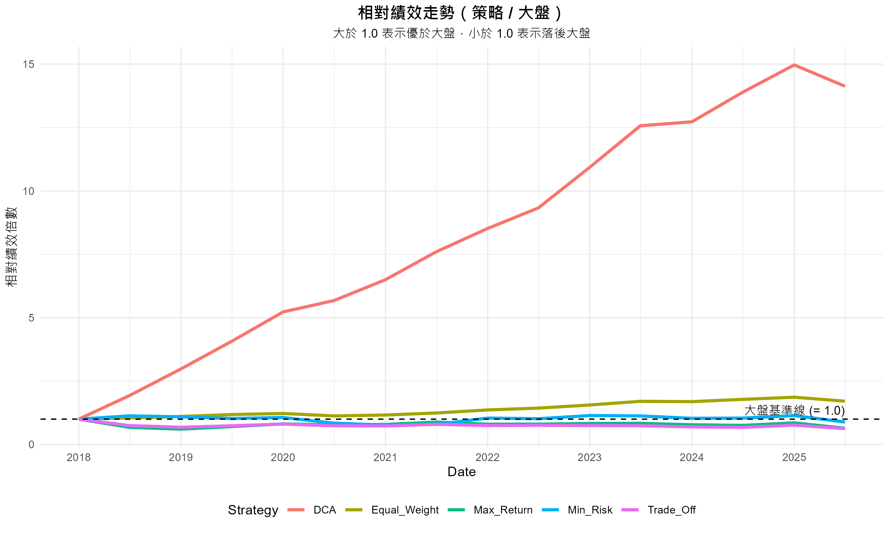
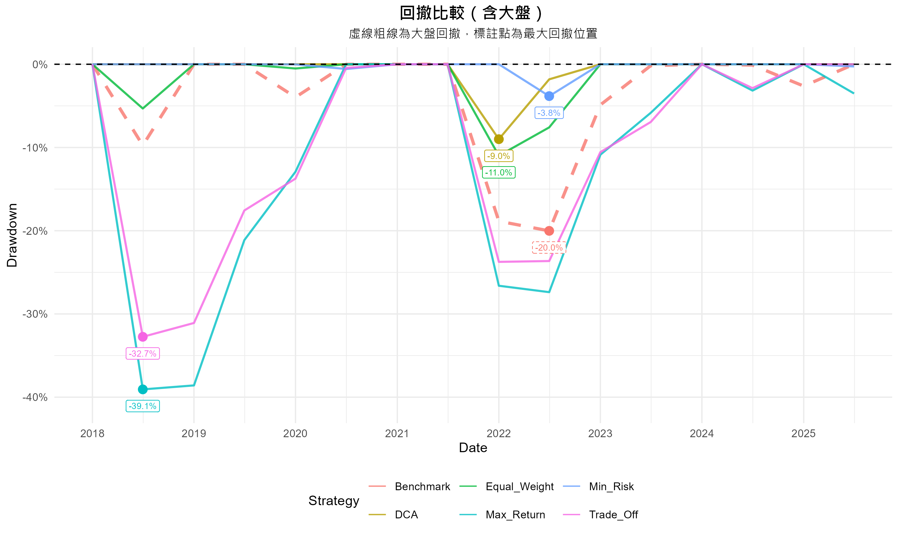
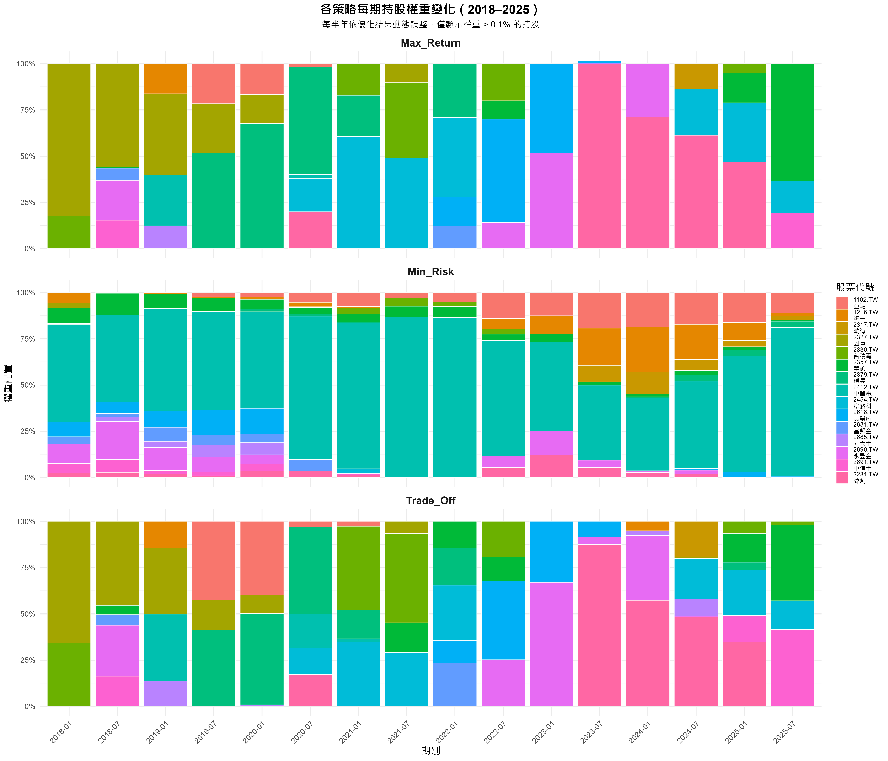

# ETF00850-Portfolio-Optimization

# 📊 投資組合優化： ETF00850成分股投資組合優化與滾動視窗回測系統

> **Portfolio Optimization with Rolling Window Backtest**
> 使用數學規劃比較五種投資策略在台灣股市（ETF 00850 成分股）的長期績效表現

---


## 📌 專案摘要

| 項目 | 內容 |
|------|------|
| 回測期間 | 2018 H1 – 2025 H2（共 16 個半年期） |
| 標的池 | ETF 00850 成分股（15 檔）|
| 大盤基準 | 加權股價指數（^TWII）|
| 語言 / 套件 | R、quantmod、nloptr、ggplot2、dplyr |
| 優化演算法 | NLOPT_LN_COBYLA（無梯度局部優化）|
| 初始資本 | 480,000 元（≡ DCA 總投入金額）|

---

## 🏆 核心結果一覽

| 策略 | 期末市值 | 年化報酬 | Sharpe | 最大回撤 | Alpha | 勝率 |
|------|--------:|-------:|------:|-------:|------:|----:|
| **Equal_Weight** ⭐ | **2,558,578** | **23.27%** | **1.415** | -10.98% | **+10.08%** | **81.2%** |
| Max_Return | 2,286,971 | 21.55% | 0.491 | -39.06% | +8.36% | 56.2% |
| Trade_Off | 1,933,577 | 19.03% | 0.502 | -32.75% | +5.83% | 37.5% |
| **Benchmark** | 1,293,415 | 13.19% | 0.731 | -20.02% | — | — |
| DCA | 1,240,469 | 12.60% | 1.197 | -9.00% | -0.59% | 81.2% |
| Min_Risk | 1,234,279 | 12.53% | 1.008 | -3.83% | -0.66% | 50.0% |

> ⭐ Equal_Weight 為唯一在統計上顯著優於大盤的策略（配對 t-test，p = 0.022）

---

## 📁 專案架構

```
Portfolio_Backtest/
├── main.R                          # 主程式（完整流程）
├── Portfolio_Backtest_Results/
│   ├── 01_績效總表_含大盤.csv
│   ├── 02_每期財富淨值序列.csv
│   ├── 03_各股票平均權重.csv
│   ├── 04_權重歷史_最大報酬.csv
│   ├── 05_權重歷史_最小風險.csv
│   ├── 06_權重歷史_平衡策略.csv
│   ├── Plots/
│   │   ├── 01_wealth_vs_benchmark.png
│   │   ├── 02_alpha_comparison.png
│   │   ├── 03_sharpe_vs_benchmark.png
│   │   ├── 04_win_rate_heatmap.png
│   │   ├── 05_risk_return_scatter.png
│   │   ├── 06_relative_performance.png
│   │   └── 07_drawdown_vs_benchmark.png
│   │   └── 08_weights_history.png
│   └── Benchmark_Analysis/
│       ├── alpha_分析.csv
│       ├── 資訊比率_分析.csv
│       ├── 勝率_分析.csv
│       └── 逐期勝負紀錄.csv
└── README.md
```

---

## ⚙️ 環境需求與安裝

```r
# 安裝必要套件
install.packages(c(
  "quantmod",   # 股票數據下載
  "nloptr",     # 非線性優化
  "dplyr",      # 資料處理
  "tidyr",      # 資料整理
  "lubridate",  # 日期處理
  "scales",     # 格式化輸出
  "ggplot2"     # 繪圖
))
```

---

## 🔍 各段落設計說明

### 1. 資料下載與前處理

使用 `quantmod::getSymbols()` 從 Yahoo Finance 下載調整後收盤價，並計算簡單日報酬率：

```r
# 下載調整後收盤價（Ad = Adjusted Close）
data <- getSymbols(ticker, src = "yahoo", from = START_DATE,
                   to = END_DATE, auto.assign = FALSE)
price <- Ad(data)

# 計算日報酬率
# 公式：R_t = (P_t / P_{t-1}) - 1
data_returns[, -1] <- (data_prices[, -1] / lag(data_prices[, -1])) - 1
data_returns <- na.omit(data_returns)
```

> **設計邏輯**：採用調整後收盤價（已還原股息、股票分割），確保歷史報酬率不失真。

#### 相關係數矩陣

```r
cor_matrix <- cor(data_returns[, -1])
```



**主要發現：**
- 金融四檔（2881/2891/2885/2890）相關係數 0.60–0.65，板塊效應最強
- 中華電（2412）與多數標的相關係數僅 0.09–0.31，分散效果最佳 → Min_Risk 策略重倉原因
- 整體相關係數範圍 0.09–0.65，具備足夠分散空間，是優化策略能發揮作用的基礎

---

### 2. 數學優化設計

#### 年化參數估計

訓練期固定 2 年，以複利方式年化期望報酬，以線性方式年化共變異矩陣：

```r
annual_factor <- nrow(train_ret) / 2   # 動態年化因子

# 年化期望報酬（複利）
mu <- (1 + colMeans(train_ret))^annual_factor - 1

# 年化共變異矩陣（線性縮放）
sigma <- cov(train_ret) * annual_factor
```

#### 三種優化問題

| 策略 | 目標函數 | 不等式限制 |
|------|---------|-----------|
| Max_Return | min $-\mathbf{w}^\top\boldsymbol{\mu}$ | $\sqrt{\mathbf{w}^\top\Sigma\mathbf{w}} \leq 0.30$ |
| Min_Risk | min $\sqrt{\mathbf{w}^\top\Sigma\mathbf{w}}$ | $\mathbf{w}^\top\boldsymbol{\mu} \geq 0.10$ |
| Trade_Off | min $-(\mathbf{w}^\top\boldsymbol{\mu} - \sqrt{\mathbf{w}^\top\Sigma\mathbf{w}})$ | $\sigma \leq 0.25$ 且 $\mu \geq 0.15$ |

共同限制條件：

```r
eval_g_eq <- function(w) sum(w) - 1  # 預算限制：Σw = 1
lb <- rep(0, n_assets)               # 非放空：w_i ≥ 0
ub <- rep(1, n_assets)               # 單一標的上限

# 求解器設定
opts <- list(algorithm = "NLOPT_LN_COBYLA", xtol_rel = 1e-6, maxeval = 5000)
res  <- nloptr(x0 = rep(1/n_assets, n_assets), eval_f = eval_f,
               eval_g_ineq = eval_g_ineq, eval_g_eq = eval_g_eq,
               lb = lb, ub = ub, opts = opts)
```

> **演算法說明**：`NLOPT_LN_COBYLA` 為無梯度局部優化器，透過線性近似處理約束，適合金融優化的非凸問題。輸出權重接近 0（如 ~1e-23）表示該資產被排除，為正常現象。

---

### 3. 滾動視窗回測

```
時間軸示意：
|← 2年訓練期 →|← 0.5年測試 →|
|← 2年訓練期 →    |← 0.5年測試 →|
               ^ 每半年滾動一次
```

```r
test_starts <- seq(as.Date("2018-01-01"), as.Date("2025-07-01"), by = "6 months")

for (i in seq_along(test_starts)) {
  test_start  <- test_starts[i]
  test_end    <- test_start + months(6) - days(1)
  train_end   <- test_start - days(1)
  train_start <- train_end - years(2) + days(1)

  # 1. 用訓練期數據求解最佳權重
  w_max   <- run_optimization(train_matrix, "max_return", threshold1 = 0.3)
  w_min   <- run_optimization(train_matrix, "min_risk",   threshold1 = 0.1)
  w_trade <- run_optimization(train_matrix, "trade_off",  threshold1 = 0.25, threshold2 = 0.15)

  # 2. 計算測試期報酬（避免 Look-ahead Bias）
  stock_ret <- (price_end / price_start) - 1
  port_ret  <- sum(w * stock_ret)
}
```

> **公平比較設定**：單筆初始資本 = `16 × 6 × 5,000 = 480,000 元`，確保與 DCA 總投入相同。

---

### 4. 績效指標計算

#### Sharpe Ratio（半年序列年化）
```r
# 公式：Sharpe = E[R] / Std[R] × √2
sharpe <- lapply(returns_history, function(r) mean(r) / sd(r) * sqrt(2))
```

#### 最大回撤
```r
calc_max_drawdown <- function(wealth_series) {
  peak     <- cummax(wealth_series)          # 滾動歷史高峰
  drawdown <- (wealth_series - peak) / peak  # 各期回撤率
  return(min(drawdown))                      # 最大跌幅
}
```

#### 資訊比率（Information Ratio）
```r
# IR = Mean(主動報酬) / Std(主動報酬) × √2
# 主動報酬 = 策略報酬 - 大盤報酬（追蹤誤差基礎）
tracking_error       <- returns_history[[s]] - returns_history$benchmark
information_ratio[i] <- mean(tracking_error) / sd(tracking_error) * sqrt(2)
```

---

### 5. 統計顯著性檢定

```r
# 配對 t-test：H0: 策略報酬 = 大盤報酬
test_result <- t.test(strategy_returns, returns_history$benchmark, paired = TRUE)
```

**結果摘要**：

| 策略 | p-value | 結論 |
|------|--------:|------|
| Equal_Weight | **0.0217** ★ | **顯著優於大盤** |
| DCA | 0.0752 | 邊際顯著（建議增加樣本） |
| 其他 | > 0.40 | 與大盤無顯著差異 |

---

## 📈 視覺化結果

### 圖一：財富累積走勢



Equal_Weight 穩居第一（255萬），Max_Return 次之（228萬）但早期波動劇烈。

---

### 圖二：超額報酬 Alpha



Equal_Weight Alpha +10.08%，顯示等權重對本標的池存在「小型股溢酬」效果。

---

### 圖三：夏普比率



Equal_Weight（1.415）風險調整後報酬最佳；Max_Return（0.491）低於大盤，高報酬源於承擔更多風險。

---

### 圖四：逐期勝負記錄



Equal_Weight 與 DCA 同為 13/16 期勝出；第 6 期（2020 H2）疫情後大盤強彈，所有策略集體落後。

---

### 圖五：風險-報酬散佈



Equal_Weight 位於左上角（效率前緣），Min_Risk 與 DCA 低風險但報酬偏低。

---

### 圖六：相對績效走勢



> 計算方式：策略市值 / 大盤市值（排除 DCA，因資金節奏不同無法公平比較）

四條線均高於基準線 1.0，表示單筆投入策略全程優於大盤：

- **Max_Return（綠線）**：波動最劇，開局達 2.7 倍但震盪大，反映高集中持股風格
- **Trade_Off（紫線）**：早期約 2.4 倍，優勢逐漸收斂至 2025 末的 1.5 倍
- **Equal_Weight（橘線）**：最穩健，從 1.1 倍緩步爬升至 2.2 倍，無明顯震盪
- **Min_Risk（藍線）**：長期在 1.0 附近游走（0.9–1.2 倍），安全但不超越大盤

---

### 圖七：回撤比較



Max_Return 最大回撤 -39.1%（2018 H2，主因國巨 2327 腰斬）；Min_Risk 僅 -3.8%，防禦性最強。

---

### 圖八：各策略每期持股權重變化



三種優化策略在 16 個半年期的持股配置動態（等權重每期均等分配，不另行呈現）：

- **Max_Return（上）**：持股集中度最高，每期由 2–4 檔主導，換倉幅度大。2018 H1 重倉國巨（2327），2018 H2 後迅速換倉，積極追逐當期高報酬標的，也是最大回撤 -39.1% 的根本原因。
- **Min_Risk（中）**：最穩定，中華電（2412）長期佔 60–85%，搭配亞泥（1102）、統一（1216）等低波動股。此配置直接解釋了最大回撤僅 -3.8% 的防禦表現。
- **Trade_Off（下）**：每期維持 3–6 檔，兼顧雙重約束換倉較穩定。2021 H1 起台積電（2330）、聯發科（2454）比重上升，與 AI 與半導體行情一致。

---

## 🐛 已知問題與待改進項目

| 問題 | 影響 | 建議修正 |
|------|------|---------|
| 未計交易成本 | 高頻調倉策略報酬高估 | 加入 0.3%（稅）+ 0.285%（佣金）|
| 倖存者偏誤 | 歷史績效偏樂觀 | 使用各年度實際成分股 |
| 局部最優解 | 優化結果不穩定 | 多起始點搜尋或全域優化器 |
| 樣本數不足（n=16） | t-test 統計力低 | 縮短測試期為季度，n 擴增至 32 |

---

## 📄 授權

MIT License — 本專案僅供學術研究與個人學習用途，不構成任何投資建議。


